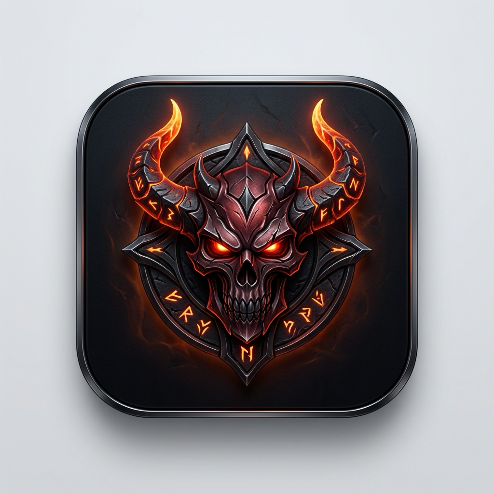

<p align="center">
  <br/>
  <h1 align="center">📖 DM_Helper 완벽 사용자 매뉴얼 & 가이드</h1>
</p>

> **DM_Helper (Diablo Mac Helper)**는 macOS(Apple Silicon M1~M4 및 Intel) 환경에서 디아블로 3와 디아블로 4를 가장 정밀하고 쾌적하게 플레이할 수 있도록 제작된 **초정밀 네이티브 게이밍 헬퍼**입니다.  
> 윈도우 대표 헬퍼인 **DHelper의 모든 고급 기능**(특수키, 단일반복키, 퀘스트키, 시간조절키, 인게임 8대 UI 연동 종료)을 100% 계승하고, 디아블로 4의 최신 복합 메커니즘인 **초기 준비 시퀀스(오프너), 자원 연계 콤보 사이클(N:M), 채널링 홀드 모드, 직업별 원클릭 프리셋, 구글 시트 공유 센터**를 탑재하였습니다.

<p align="center">
  
</p>

---

## 📑 목차
1. [⚡️ 3분 퀵 스타트 (초보자 빠른 시작)](#1-️-3분-퀵-스타트-초보자-빠른-시작)
2. [🖥 UI 화면 구성 및 3대 탭 안내](#2--ui-화면-구성-및-3대-탭-안내)
3. [🎮 D4 직업별 원클릭 프리셋 & 운용법](#3--d4-직업별-원클릭-프리셋--운용법)
4. [🔄 초기 준비 시퀀스 (Opener & Ramp-up)](#4--초기-준비-시퀀스-opener--ramp-up)
5. [⚔️ 스킬 연계 콤보 사이클 (Generator-to-Spender)](#5-️-스킬-연계-콤보-사이클-generator-to-spender)
6. [🖐 스킬 시전 방식 (연타 vs 홀드/채널링)](#6--스킬-시전-방식-연타-vs-홀드채널링)
7. [💎 DHelper 정통 편의 기능 (단일반복/특수키/퀘스트키)](#7--dhelper-정통-편의-기능-단일반복특수키퀘스트키)
8. [🛡 안전 및 편의 시스템 (인게임 UI 연동 & 데드존)](#8--안전-및-편의-시스템-인게임-ui-연동--데드존)
9. [❓ 자주 묻는 질문 및 문제 해결 (FAQ)](#9--자주-묻는-질문-및-문제-해결-faq)

---

## 1. ⚡️ 3분 퀵 스타트 (초보자 빠른 시작)

```
[1. 앱 실행] ──▶ [2. 직업 프리셋 선택] ──▶ [3. 게임 접속 후 시작키('[') 입력]
                     (예: 악마술사)                 (버프 켜고 폭풍 사냥 시작!)
```

1. **앱 실행 및 권한 허용**:
   - 앱 최초 실행 시 `시스템 설정 > 개인정보 보호 및 보안 > 손쉬운 사용`에서 허용합니다.
2. **원클릭 직업 프리셋 선택**:
   - 메인 창 상단의 **`직업 프리셋 적용 ▼`** 드롭다운을 클릭하고, 본인의 직업(예: **악마술사**, **원소술사**, **야만용사** 등)을 선택합니다.
   - 오프너 스킬, 쿨다운 주기, 연타 속도가 최적값으로 자동 세팅됩니다.
3. **게임 화면에서 시작**:
   - 디아블로 4(또는 3) 게임 화면으로 전환한 뒤 시작 단축키인 **`[` (대괄호 열기)** 키를 누릅니다.
   - 효과음(`Tink`)과 함께 상단 상태가 **`● 동작 중`**으로 바뀌며 오토가 시작됩니다.
   - 중지할 때는 다시 **`[`** 키를 누르면 즉시 정지(`Pop` 효과음)됩니다.

---

## 2. 🖥 UI 화면 구성 및 3대 탭 안내

메인 창은 상단 제어 바와 3개의 전문 탭으로 직관화되어 있습니다.

```
┌────────────────────────────────────────────────────────────────────────────────────────┐
│ [프로필 1~5] [직업 프리셋 ▼] [▶ 시작] [⚡️ 준비 시퀀스] [🌐 시트 공유] [📖 가이드] ● 상태 │
├────────────────────────────────────────────────────────────────────────────────────────┤
│ ┌───────────────────┬───────────────────────────────┬──────────────────────────┐       │
│ │  탭 1: 기본 헬퍼   │  탭 2: 로테이션 & 준비 시퀀스   │  탭 3: 단일반복 & 편의기능│       │
│ └───────────────────┴───────────────────────────────┴──────────────────────────┘       │
│                                                                                        │
│   • 탭 1: 시작/종료키 & 준비 키(오프너), 기술 1~8 키 매핑, 연타/홀드 모드, 주기(ms)   │
│   • 탭 2: 5단계 오프너(스택 준비), 자원 생성-소모 연계 콤보 사이클 (N:M 교대)          │
│   • 탭 3: 단일반복키(템줍기/카달라), 특수키, 퀘스트키, 시간조절키, 데드존 필터         │
└────────────────────────────────────────────────────────────────────────────────────────┘
```

### 상단 제어 바 핵심 조작
* **설정 프로필 [1] ~ [5]**: 5개의 저장 슬롯을 지원합니다. (단축키 `F1` ~ `F5`로 게임 중 즉시 전환 가능)
* **`직업 프리셋 적용 ▼`**: 클릭 한 번으로 공인 빌드 세팅(악마술사 타오르는 비명, 원소술사 번개창, 야만용사 소용돌이 등)을 불러옵니다.
* **`▶ 동작 시작 / ■ 동작 중지`**: 마우스 클릭으로 수동 온/오프 토글.
* **`⚡️ 준비 시퀀스`**: 설정된 5단계 오프너(버프/스택)를 지금 즉시 1회 단독 실행합니다.
* **`🌐 시트 공유`**: **구글 시트 프리셋 공유 센터**를 열어 유저별, 시즌별, 빌드별 클라우드 프리셋을 실시간 검색하고 원클릭으로 내 슬롯에 가져오거나 공유합니다.
* **`📖 가이드`**: 인앱 완벽 설명서 창 열기 (`Cmd + ?`).
* **키 입력 필드 조작 팁**:
  - 입력칸을 마우스로 클릭한 뒤 원하는 키(키보드, 마우스 휠, 사이드 버튼)를 누르면 자동 등록됩니다.
  - **`ESC` 또는 `Delete(Backspace)` 키**: 입력칸을 비우고 설정을 해제합니다 (우클릭 메뉴 '설정 해제'로도 비우기 가능).

---

## 3. 🎮 D4 직업별 원클릭 프리셋 & 운용법

| 직업 / 빌드 | 주요 특징 및 메커니즘 | 프리셋 구성 내용 |
|---|---|---|
| 🔥 **악마술사**<br/>(타오르는 비명) | **나락 150단 최상위 오토봄버**<br/>시너지 소환 → 탈태(변신) 지배력 버프 획득 → 군중제어 후 타오르는 비명 무한 난사 | • **오프너**: 1단계 아보디안 소환 → 2단계 탈태 → 3단계 어둠의 감옥 → 4단계 인장<br/>• **본 루프**: 탈태/감옥 쿨타임 유지 + 우클릭(타오르는 비명) 120ms 고속 연타 |
| 🔮 **원소술사**<br/>(번개창 / 탈라샤) | **보호막 & 4원소 스택 빌드업**<br/>얼음갑옷으로 생존 확보 후 기본기 3회로 탈라샤/구현 스택을 쌓고 메인 공격 | • **오프너**: 1단계 얼음갑옷 → 2단계 순간이동 → 3단계 번개창 → 4단계 화염탄 3회<br/>• **본 루프**: 보호막/순간이동 쿨마다 유지 + 연쇄번개/번개창 자동 시전 |
| ⚔️ **야만용사**<br/>(소용돌이 채널링) | **3함성 분노 폭발 & 휠윈드 홀드**<br/>자원 및 광폭화 함성 3종 순차 발동 후 소용돌이를 끊김 없이 유지 | • **오프너**: 1단계 집결의 함성 → 2단계 도전의 외침 → 3단계 전장의 함성<br/>• **본 루프**: 3함성 쿨마다 재시전 + **우클릭(소용돌이) [홀드(누름)] 모드** |
| 🏹 **도적**<br/>(3콤보 포인트) | **기본기 3회 → 핵심기 1회 콤보**<br/>구멍 뚫기 3타로 콤보 포인트를 풀충전한 뒤 회전 칼날 1타 방출 | • **오프너**: 암흑 주입 → 그림자 걸음 진입<br/>• **콤보 루프**: 생성기(3번) 3회 ↔ 소모기(우클릭) 1회 자동 교대 (130ms) |
| 💀 **강령술사**<br/>(시폭 & 뼈창) | **골렘/저주 디버프 & 폭딜**<br/>저주와 시체 촉수로 취약 및 군중제어를 걸고 시폭/뼈창 난사 | • **오프너**: 골렘 사용 → 노화 저주 광역 살포 → 시체 촉수<br/>• **본 루프**: 뼈창(200ms) + 시체 폭발(120ms) 고속 연타 |
| 🦅 **혼령사**<br/>(태세 & 제압) | **태세 버프 & 결의 스택 제압**<br/>태세 변환 후 결의를 쌓아 제압 핵심 기술 폭딜 | • **오프너**: 태세 버프 가동 → 결의 스택 누적<br/>• **콤보 루프**: 깃털 투척 3회 ↔ 제압기 1회 (140ms) 교대 |

### 🌐 구글 시트 프리셋 공유 센터 (Google Sheets Hub)
상단바의 **`[ 🌐 시트 공유 ]`** 버튼을 누르면 전 세계 유저들이 등록한 최신 시즌/빌드 세팅을 한눈에 보고 즉시 내 헬퍼로 가져올 수 있습니다.

1. **실시간 필터 & 검색**:
   - **시즌별**: `시즌 6 (증오의 그릇)`, `시즌 7`, `영원`, `디아블로 3` 등 구분
   - **직업별**: `악마술사`, `원소술사`, `야만용사`, `도적`, `강령술사`, `혼령사`, `드루이드` 등
   - **키워드 검색**: 작성자 닉네임, 빌드명, 설명 검색
2. **원클릭 내 헬퍼로 가져오기**:
   - 목록에서 원하는 빌드를 선택하고 하단에서 적용할 프로필 슬롯(1~5)을 선택한 뒤 **`[ 📥 내 헬퍼로 가져오기 (적용) ]`**을 누르면 즉시 로드됩니다.
3. **내 빌드 구글 시트에 공유하기**:
   - 현재 내가 세팅한 헬퍼 구성을 커뮤니티에 공유하고 싶다면 **`[ 📤 현재 내 설정 시트에 공유... ]`**를 누릅니다.
   - 닉네임, 시즌, 직업, 빌드명, 팁을 적고 등록하면 클라우드에 공유되며 **`[ 📋 시트 행 복사 ]`**로 시트에 `Cmd + V` 붙여넣기도 가능합니다.
4. **길드/클랜 전용 구글 시트 연동 (`⚙️ 시트 설정`)**:
   - 클랜이나 지인들과만 공유하는 비공개 구글 시트가 있다면 시트 설정 창에 스프레드시트 URL을 등록하면 해당 시트의 데이터가 실시간 연동됩니다.

---

## 4. 🔄 초기 준비 시퀀스 (Opener & Ramp-up)

> **"사냥 시작할 때 버프 켜고, 변신하고, 평타 3대 때려서 스택 쌓는 과정을 자동으로!"**


### 메인 화면에서 원터치 키 지정
* 첫 번째 화면인 **`기본 헬퍼`** 탭의 **`[시작 / 종료 & 준비 시퀀스 키]`** 박스에서 **`준비 키`** 입력 필드와 **`사용`** 체크박스가 제공됩니다.
* 탭 2로 이동하지 않고도 메인 화면에서 바로 원하는 키(예: `F1`, `Num 0` 등)를 지정하고 On/Off 할 수 있으며, 탭 2의 상세 설정과 실시간 양방향으로 완벽 동기화됩니다.

### 설정 방법 (`로테이션 & 준비 시퀀스` 탭)
1. **`시작 시 준비 시퀀스 자동 실행`**에 체크합니다.
2. 1단계부터 최대 5단계까지 필요한 스킬을 배치합니다:
   - **스킬 키**: 발동할 기술 키 등록
   - **실행 간격(ms)**: 다음 스킬로 넘어가기 전 대기 시간 (모션 딜레이 고려, 100~200ms 권장)
   - **반복 횟수 (1~10회)**: 스택을 쌓아야 하는 평타의 경우 3회 등으로 지정
   - **스텝 설명**: 기억하기 쉽도록 스킬 명칭 메모 (예: "얼음 갑옷", "탈태")
3. **수동 트리거 키 (기본: F1)**:
   - 필드 이동 중 버프가 꺼졌거나 보스방 진입 시, 단축키를 누르면 전투 루프 도중에도 즉시 오프너를 1회 재실행합니다.

---

## 5. ⚔️ 스킬 연계 콤보 사이클 (Generator-to-Spender)

> **"도적의 3콤보 포인트, 야만용사의 분노 수급기/소모기를 완벽한 박자로!"**

* **문제점**: 생성기와 소모기를 동시에 연타하면 모션이 씹히거나 콤보 포인트가 쌓이지 않은 채 헛스윙합니다.
* **해결책**: 생성기 A를 정확히 N번 때린 후, 소모기 B를 M번 시전하는 교대 루프를 실행합니다.

### 설정 방법 (`로테이션 & 준비 시퀀스` 탭)
1. **`연계 콤보 활성화`**에 체크합니다.
2. **스택 생성기 (A)**: 평타/기본기 키 지정 (예: `3`) & 횟수 입력 (예: `3`회)
3. **핵심 소모기 (B)**: 폭딜/주력기 키 지정 (예: `우클릭`) & 횟수 입력 (예: `1`회)
4. **발동 주기(ms)**: 공격 속도에 맞춰 100~150ms로 조절합니다.

---

## 6. 🖐 스킬 시전 방식 (연타 vs 홀드/채널링)

기술 1~8번 슬롯 우측의 **`시전 방식`** 팝업 메뉴를 통해 개별 설정할 수 있습니다.

* **`연타 (Spam)`** (기본값):
  - 지정된 주기(ms)마다 키를 눌렀다 뗍니다.
  - 쿨타임 스킬(보호막, 탈태, 함성)이나 일반 난사 스킬에 사용합니다.
* **`홀드(누름) (Hold)`**:
  - 헬퍼가 켜지는 순간 **키를 꾹 누르고 있는 상태(KeyDown)**를 유지하고, 헬퍼가 꺼질 때 뗍니다.
  - **적용 추천**: 야만용사의 **소용돌이(Whirlwind)**, 원소술사의 **소각(Incinerate)** 등 누르고 있어야 자원 누수 없이 부드럽게 돌아가는 지속 채널링 기술.
  - 플레이어가 이동을 위해 퀘스트키/특수키를 누르면 안전하게 잠시 떼어집니다.

---

## 7. 💎 DHelper 정통 편의 기능 (단일반복/특수키/퀘스트키)

`단일반복 & 편의기능` 탭에 위치하며, 게이머의 피로도를 획기적으로 줄여줍니다.

### ① 단일반복키 (최대 3개)
* **특징**: 메인 헬퍼 온/오프 여부와 상관없이 **단축키를 누르고 있는 동안만 초고속 동작**합니다.
* **1번 (Grave `~`) - 폭풍 아이템 줍기**:
  - 누르고 있으면 마우스 좌클릭이 50ms로 쏟아져 바닥의 아이템, 금화, 보석, 신단을 순식간에 루팅합니다.
* **2번 (Tab) - 카달라/상점 대량 겜블**:
  - 누르고 있으면 마우스 우클릭이 60ms로 연타되어 1초 만에 가방 가득 쇼핑합니다.

### ② 특수키 (최대 3개)
* 누르고 있는 동안 **체크박스에 체크된 스킬들의 자동 시전을 일시 정지**합니다.
* **쿨타임 대기 모드**:
  - **체크 시**: 특수키를 뗐을 때 원래 남은 쿨타임을 기다렸다가 스킬 발동 (버프 주기 엄격 유지).
  - **체크 해제 시**: 특수키를 떼자마자 즉시 1회 시전 후 원래 주기 재개.

### ③ 퀘스트키
* NPC와 대화하거나 대장장이/비술사 메뉴를 볼 때 헬퍼가 계속 스킬을 써서 창이 닫히는 현상을 방지합니다.
* 퀘스트키를 누르고 있는 동안 **모든 스킬 연타가 전면 정지**됩니다.

### ④ 시간조절키 (신단 토글)
* 도관 신단, 재사용 대기시간 감소 신단을 먹었을 때 1회 누르면 전 스킬 주기가 설정된 오프셋(ms)만큼 가속됩니다.

---

## 8. 🛡 안전 및 편의 시스템 (인게임 UI 연동 & 데드존)

### ① 인게임 8대 UI 연동 자동 정지
게임 내에서 아래 단축키를 눌러 메뉴를 열면, 글자가 채팅창에 찍히거나 스킬 발동으로 포탈이 끊기는 참사를 방지하기 위해 **헬퍼가 즉시 자동 종료**됩니다:
* `I` (소지품 가방), `S` (기술창), `F` (추종자/소셜), `M` (지도), `T` (마을 차원문), `Enter` (채팅), `R` (귓속말)

### ② 방해금지 데드존 필터링
* 마우스 좌클릭을 반복 등록해 두었을 때, 화면 하단의 **스킬 단축바 영역, 체력/자원 구슬 영역, 우상단 미니맵 영역**에 마우스 커서가 올라가 있으면 클릭을 자동으로 무시하여 원치 않는 UI 조작을 방지합니다.

---

## 9. ❓ 자주 묻는 질문 및 문제 해결 (FAQ)

### Q1. 시작키를 눌렀는데 게임에서 아무 반응이 없어요.
* **해결 1 (최전면 확인)**: 헬퍼는 게임 화면이 최전면(Active)일 때만 작동합니다. 디아블로 창을 한 번 클릭한 뒤 시작키를 눌러주세요.
* **해결 2 (손쉬운 사용 권한)**: macOS를 업데이트했거나 앱을 새로 복사한 경우, `시스템 설정 > 개인정보 보호 및 보안 > 손쉬운 사용`에서 `DM_Helper`를 목록에서 **제거(-)** 후 다시 **추가(+)**해 주세요.

### Q2. 마우스 휠이나 사이드 버튼도 등록할 수 있나요?
* 네! 키 입력칸을 클릭한 후 마우스 휠을 위/아래로 굴리거나 사이드 버튼을 누르면 `Wheel Up`, `Wheel Down`, `XButton 1` 등으로 완벽 등록됩니다.

### Q3. 시작키와 종료키를 따로 쓰거나 하나로 쓸 수 있나요?
* 시작키와 종료키를 동일하게 설정(예: 둘 다 `[`)하면 **원버튼 On/Off 토글**로 동작합니다. 따로 지정하고 싶다면 종료키에 다른 키를 입력하시면 됩니다.
